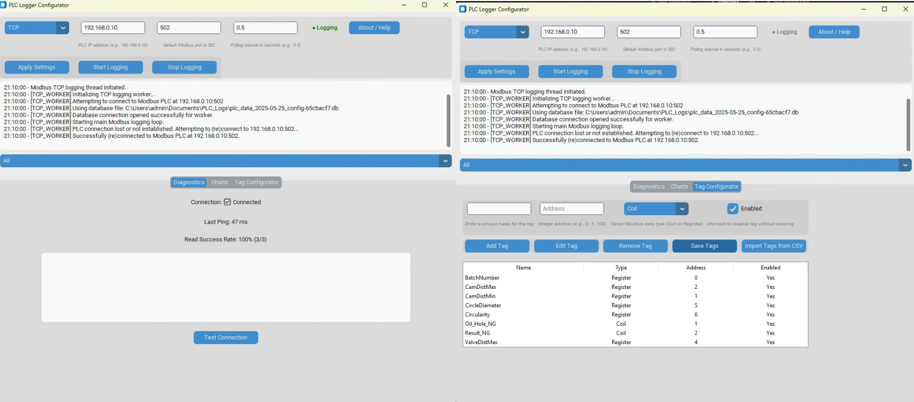

# PLC Data Logger and Configurator

<p align="center">
  
  <br/>
  <em>Main window showing logging controls, diagnostics, and tag configuration.</em>
</p>

This application allows users to configure and log data from Programmable Logic Controllers (PLCs) using Modbus TCP and Beckhoff ADS protocols. It features a user-friendly GUI for tag configuration, real-time diagnostics, and data visualization.

---

## 🚀 Quick Start

### 1. Clone the repository
```bash
git clone https://github.com/Sorsys-PLC/DataLogger.git
cd DataLogger
```

### 2. Install dependencies
```bash
pip install -r requirements.txt
```

### 3. Run the application
```bash
python main.py
```

Or double-click `RunLogger.bat` on Windows.

---

## 🔧 Features

- **Dual Protocol Support**: Modbus TCP and Beckhoff ADS.
- **Tag Configuration**:
  - Add/edit/remove tags
  - Import tags from CSV (Productivity Suite format)
- **Real-time Diagnostics**:
  - Monitor connection health and ping
  - View read success rates
- **Data Charting**:
  - Plot tag values over time
  - Filter by tag and time
  - Export charts and CSV
- **Auto-Start Logging** when PLC is responsive
- **Safe Configuration Management**:
  - Stores tags and settings in `plc_logger_config.json`
  - Uses config-hashed filenames for DBs to avoid overwrites
- **Windows Task Scheduler Ready**

---

## 📁 Project Structure

| File                     | Purpose                            |
|--------------------------|------------------------------------|
| `main.py`                | App entry point                    |
| `gui_main.py`            | Main GUI class and logic           |
| `tcp_logger.py`          | Modbus TCP data pull               |
| `ads_data_pull.py`       | Beckhoff ADS data pull             |
| `ChartTab.py`            | Time-series viewer                 |
| `diagnostics_tab.py`     | PLC connection monitor             |
| `tag_configurator_tab.py`| Tag add/edit interface             |
| `tag_import_utils.py`    | CSV importer logic                 |
| `utils.py`               | Shared logic, config, DB handling  |

---

## 📦 Requirements

- Python 3.10 or higher
- `customtkinter`
- `pymodbus`
- `pyads`
- `matplotlib`
- `pandas`

Install all dependencies with:
```bash
pip install -r requirements.txt
```

---

## 📝 License

This project is licensed for non-commercial use only.  
Commercial use requires written permission — see [LICENSE.txt](LICENSE.txt).

---

## 💬 Contact

For support or feature requests, open an issue on GitHub or contact [yourname@company.com].

